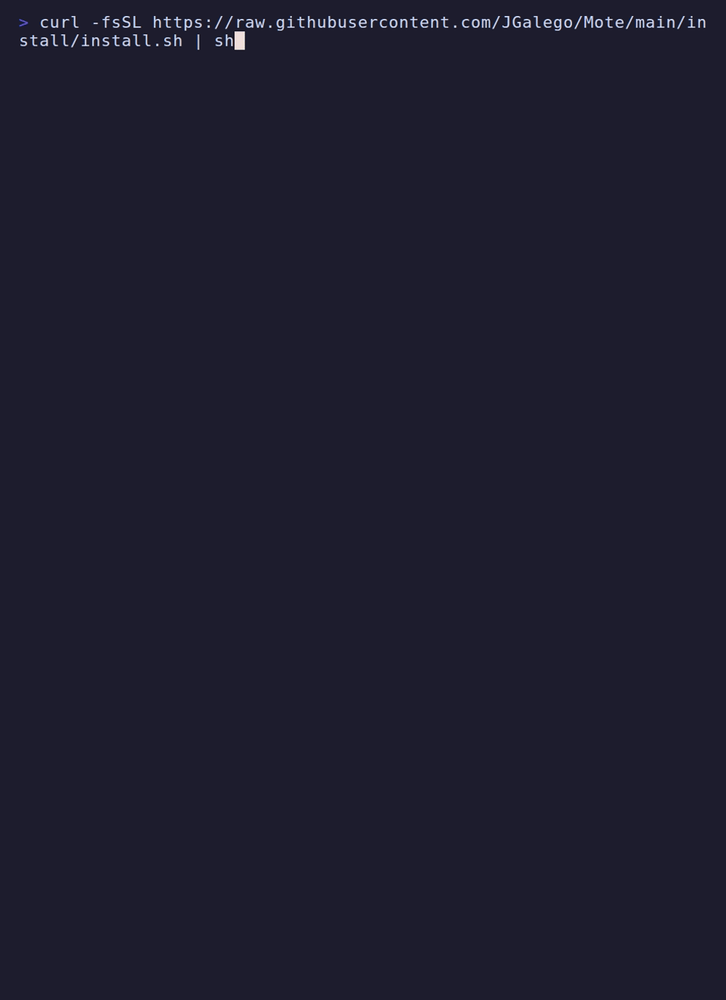
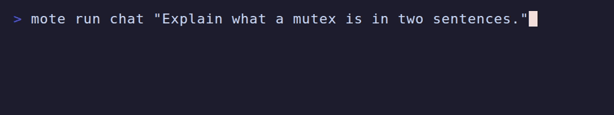
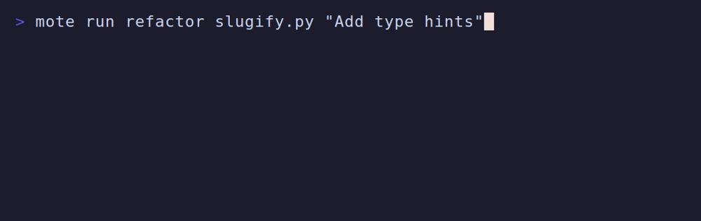
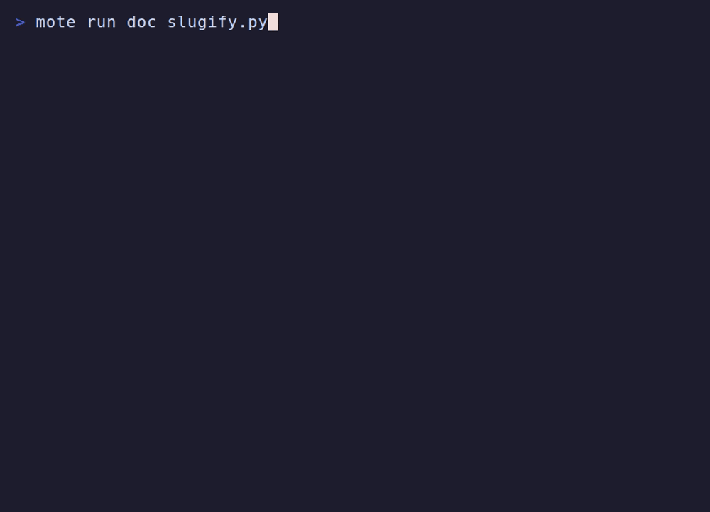
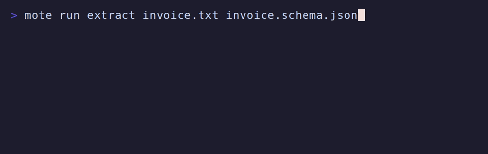
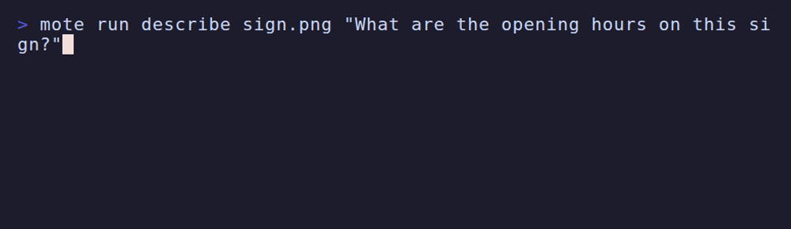
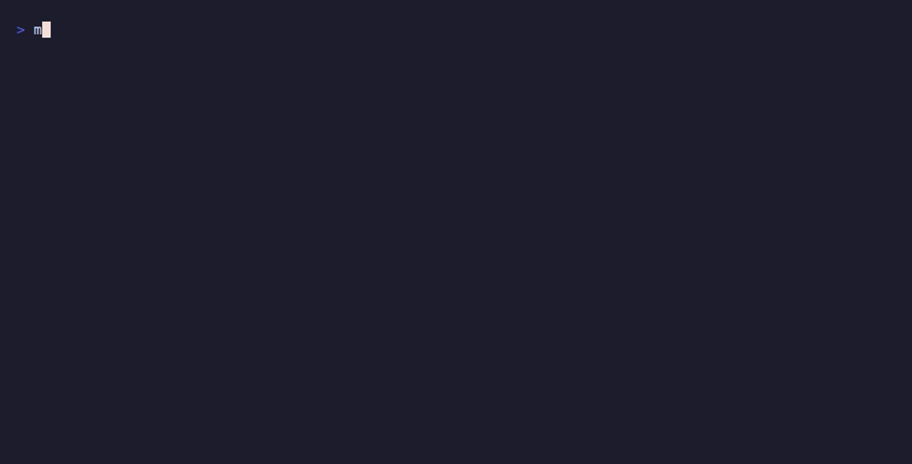
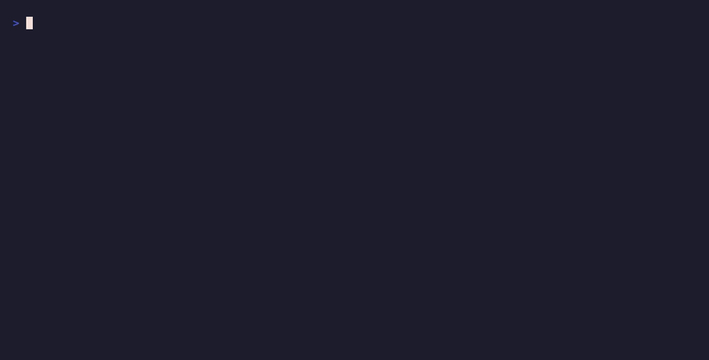
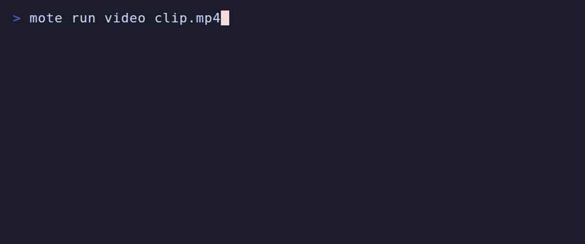

<h1 align="center">mote</h1>

<p align="center">Small models, local machines, useful work.</p>

<p align="center">
  <a href="https://github.com/JGalego/Mote/actions/workflows/ci.yml"></a>
  <a href="https://github.com/JGalego/Mote/releases/latest"></a>
  <a href="LICENSE"></a>
  
</p>

mote runs X-to-Y AI tasks (text, code, images, audio, video, files) on your
CPU with small quantized models. It is a single static binary that drives
[llama.cpp](https://github.com/ggml-org/llama.cpp) and the tools you already
have (ffmpeg, git, your editor). No accounts, no cloud inference, no telemetry.

## Getting started

Linux (Ubuntu and comparable distributions):

```sh
curl -fsSL https://raw.githubusercontent.com/JGalego/Mote/main/install/install.sh | sh
```

macOS:

```sh
curl -fsSL https://raw.githubusercontent.com/JGalego/Mote/main/install/install.sh | sh
```

Windows (PowerShell):

```powershell
irm https://raw.githubusercontent.com/JGalego/Mote/main/install/install.ps1 | iex
```

The installer downloads one release binary, checks it against the release's
`SHA256SUMS`, installs it without root/admin rights (`~/.local/bin` or
`%LOCALAPPDATA%\Programs\mote`) and starts `mote setup`. To read it first:
download `install/install.sh` (or `.ps1`), inspect it, then run it; any
arguments are passed to `mote setup` (e.g. `sh install.sh --yes`).

`mote setup` detects OS, CPU, RAM and installed tools, then asks at most a
few questions: speed/quality/disk profile, editor (if you have several),
whether to reuse an existing llama.cpp, data directory, and whether models may
be downloaded automatically. It installs the pinned llama.cpp CPU build
(checksum-verified) and offers to fetch the text model, showing size and
license first. For automation: `mote setup --config examples/setup.json` or
`mote setup --yes`.

## Install and setup



## First run

```sh
mote run chat "Explain what a mutex is in two sentences"
mote run code "Python function that parses ISO 8601 dates" -o dates.py
mote run extract examples/invoice.txt examples/invoice.schema.json
mote run describe photo.jpg "What is on the sign?"
mote run transcribe meeting.m4a -o meeting.txt  # ffmpeg converts non-WAV input
mote run speak "Build finished" -o done.wav
mote run video clip.mp4                         # frames + speech -> summary
mote run patch ./src "Rename load to read_config" --apply
```

`mote tasks` lists tasks and what each needs; `mote doctor` checks the
installation; `mote models` shows models, sizes and which are in use. Exit
codes: 0 ok, 1 error, 2 usage, 3 missing setup, model or tool.

## text → text



## text → code


## code → code



## code → documentation



## document → structured data



## image + text → text



## audio → text


## text → audio



## video → images



## video → text



## image → image


## directory → code changes


## Local and CPU-only

Inference runs in a llama.cpp server bound to `127.0.0.1` with GPU offload
disabled (`--device none`). Model weights (GGUF) are fetched from Hugging Face
only when you ask or allow it, pinned to a commit and verified by SHA-256.
Downloads, the runtime, logs and benchmark results live in the data directory
(`~/.local/share/mote`, `~/Library/Application Support/mote`,
`%LOCALAPPDATA%\mote`); configuration lives in the OS config directory. After
setup, nothing contacts the network except `mote update` and explicit pulls.

Tasks are short pipelines in [`internal/task/tasks.json`](internal/task/tasks.json):
steps call a model capability (`text`, `code`, `extract`, `vision`, `asr`,
`tts`) or a local tool (ffmpeg, git). Each capability is served by a
specialized model rather than one general model.

## Model selection and self-improvement

[`registry/models.json`](registry/models.json) is generated from
[`candidates.json`](registry/candidates.json) (models and quantizations we
consider) and [`policy.json`](registry/policy.json) (per-capability benchmark
thresholds for the `small`, `balanced` and `quality` profiles). For each
capability mote picks the smallest model that fits your RAM and meets the
threshold; `mote models why text` prints the reasoning and sources.

- Upstream measurements come from Hugging Face `evalResults` and are stored
  with source URL, date and verification flag. Nothing is estimated into a
  measurement; RAM figures in the registry are labelled estimates.
- A daily workflow ([`refresh.yml`](.github/workflows/refresh.yml)) re-reads
  that data, file hashes and the llama.cpp release, validates, tests and
  smoke-tests the result, and commits to `main` only when something changed.
  If a source is unavailable the previous entries are kept.
- `mote bench` measures installed models locally (startup, tokens/s, peak
  RSS, pass/fail on small checks); results stay in your data directory.
  `mote tune` proposes config changes from those measurements and
  `mote tune --apply` records them. Every config version is kept:
  `mote config history`, `mote config rollback`.

## License

MIT. Models are downloaded under their own licenses, shown before download.
