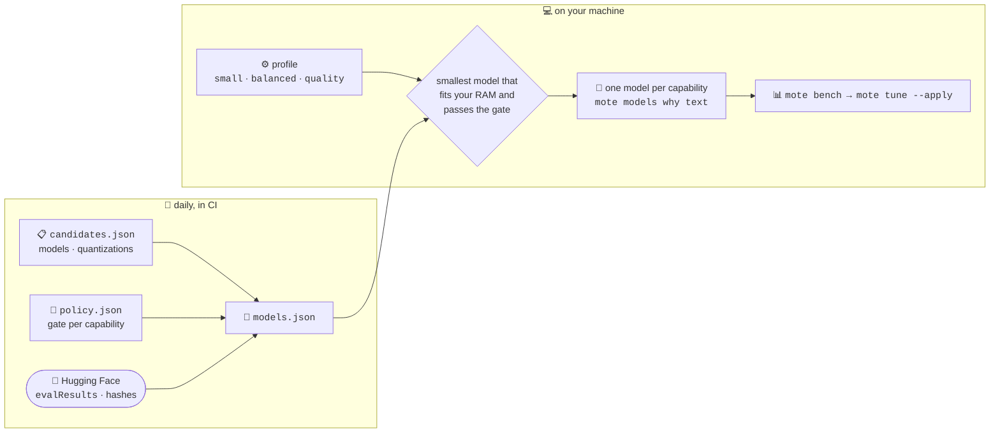

<p align="center">
  <picture>
    <source media="(prefers-color-scheme: dark)" srcset="docs/logo/mote-dark.svg">
    
  </picture>
</p>

<p align="center">Small models, local machines, useful work.</p>

<p align="center">
  <a href="https://github.com/JGalego/Mote/actions/workflows/ci.yml"></a>
  <a href="https://github.com/JGalego/Mote/releases/latest"></a>
  <a href="LICENSE"></a>
  
</p>

mote runs X-to-Y AI tasks (text, code, images, audio, video, files) on your CPU with small quantized models. It is a single static binary that drives [llama.cpp](https://github.com/ggml-org/llama.cpp) and the tools you already have (`ffmpeg`, `git`, your editor). No accounts, no cloud inference, no telemetry.

## Contents

- [Getting started](#getting-started)
- [Commands](#commands)
- [Tasks](#tasks)
  - [chat](#chat---)
  - [code](#code---)
  - [refactor](#refactor---)
  - [doc](#doc---)
  - [extract](#extract---)
  - [describe](#describe-----)
  - [transcribe](#transcribe---)
  - [speak](#speak---)
  - [frames](#frames---)
  - [video](#video---)
  - [convert](#convert---)
  - [patch](#patch---)
  - [your own](#your-own-)
- [How it works](#how-it-works)
- [Models](#models)
- [License](#license)

## Getting started

### Linux 🐧 / macOS 🍎

```sh
curl -fsSL https://raw.githubusercontent.com/JGalego/Mote/main/install/install.sh | sh
```

### Windows 🪟

```powershell
irm https://raw.githubusercontent.com/JGalego/Mote/main/install/install.ps1 | iex
```


## Commands

| Command | What it does |
| --- | --- |
| `mote setup [--profile P] [--yes]` | Install the runtime and the models for a profile (`small`, `balanced`, `quality`) |
| `mote run TASK [ARGS...]` | Run a task, e.g. `mote run chat "Explain what a mutex is"`; `-o FILE` writes the output, `--model ID` overrides the model, `--apply` writes `patch` changes |
| `mote tasks` | List the tasks, their arguments and what each one needs |
| `mote models [pull\|rm\|why\|verify]` | Show models, sizes and which are in use; fetch, remove, explain or re-verify them |
| `mote bench [--full]` | Measure installed models locally: startup, tokens/s, peak RSS, small pass/fail checks |
| `mote tune [--apply]` | Propose config changes from those measurements, and record them with `--apply` |
| `mote doctor` | Check the installation: runtime, models, tools, data directory |
| `mote config [show\|set\|history\|rollback\|edit]` | Show or change the configuration; every version is kept |
| `mote update [--check]` | Update mote, or only report whether an update exists |
| `mote version` | Print the version |

## Tasks

### chat 📝 → 📝

`mote run chat PROMPT` — Answer a prompt.


### code 📝 → 💻

`mote run code PROMPT` — Write code from a description.


### refactor 💻 → 💻

`mote run refactor FILE INSTRUCTION` — Rewrite a source file following an instruction.


### doc 💻 → 📖

`mote run doc FILE` — Write Markdown documentation for a source file.


### extract 📄 → 📊

`mote run extract FILE [SCHEMA]` — Extract structured JSON from a document.


### describe 📷 + 📝 → 📝

`mote run describe IMAGE [QUESTION]` — Describe an image or answer a question about it.


### transcribe 🔊 → 📝

`mote run transcribe AUDIO` — Transcribe speech from an audio or video file (ffmpeg converts non-WAV input).


### speak 📝 → 🔊

`mote run speak TEXT` — Synthesize speech to a WAV file.


### frames 🎬 → 📷

`mote run frames VIDEO [COUNT]` — Extract evenly spaced frames from a video.


### video 🎬 → 📝

`mote run video VIDEO` — Summarize a video from sampled frames and its speech.


### convert 📷 → 📷

`mote run convert FILE [WIDTH]` — Convert or resize an image, audio or video file with ffmpeg.


### patch 📁 → 🩹

`mote run patch DIR INSTRUCTION` — Propose changes to a directory as a diff; `--apply` writes them to disk.


### your own 🧩

Tasks are data, not code: put a file shaped like
[`tasks.json`](internal/task/tasks.json) in `tasks/*.json` under the config
directory (`mote tasks` prints the path) and it is validated, listed as
`custom` and run like the rest. An id that matches a built-in replaces it.
See [extending mote](docs/extending.md).

## How it works


Inference runs in a llama.cpp server bound to `127.0.0.1` with GPU offload disabled (`--device none`). GGUF weights come from Hugging Face only when you allow it, pinned to a commit and verified by SHA-256.

Models, logs and benchmark results live in the data directory (`~/.local/share/mote`, `~/Library/Application Support/mote`, `%LOCALAPPDATA%\mote`), configuration in the OS config directory. After setup, only `mote update` and explicit pulls touch the network.

Tasks are short pipelines in [`internal/task/tasks.json`](internal/task/tasks.json): each step calls a model capability (`text`, `code`, `extract`, `vision`, `asr`, `tts`) or a local tool (`ffmpeg`, `git`), and every capability has its own specialized model.

## Models



[`registry/models.json`](registry/models.json) is generated from [`candidates.json`](registry/candidates.json) (the models and quantizations we consider) and [`policy.json`](registry/policy.json) (per-capability thresholds for the `small`, `balanced` and `quality` profiles): mote picks the smallest model that fits your RAM and meets the threshold, and `mote models why text` prints the reasoning and sources.

Scores come from Hugging Face `evalResults`, stored with source, date and verification flag; RAM figures are labelled estimates. A [daily workflow](.github/workflows/refresh.yml) re-reads them and commits only what changed. Locally, `mote bench` measures installed models, `mote tune --apply` turns the results into config, and `mote config rollback` undoes it.

## License

[MIT 🏛️](LICENSE.md)

Models are downloaded under their own licenses, which are shown before download.
