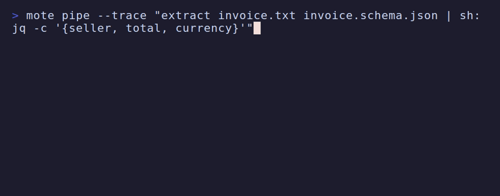
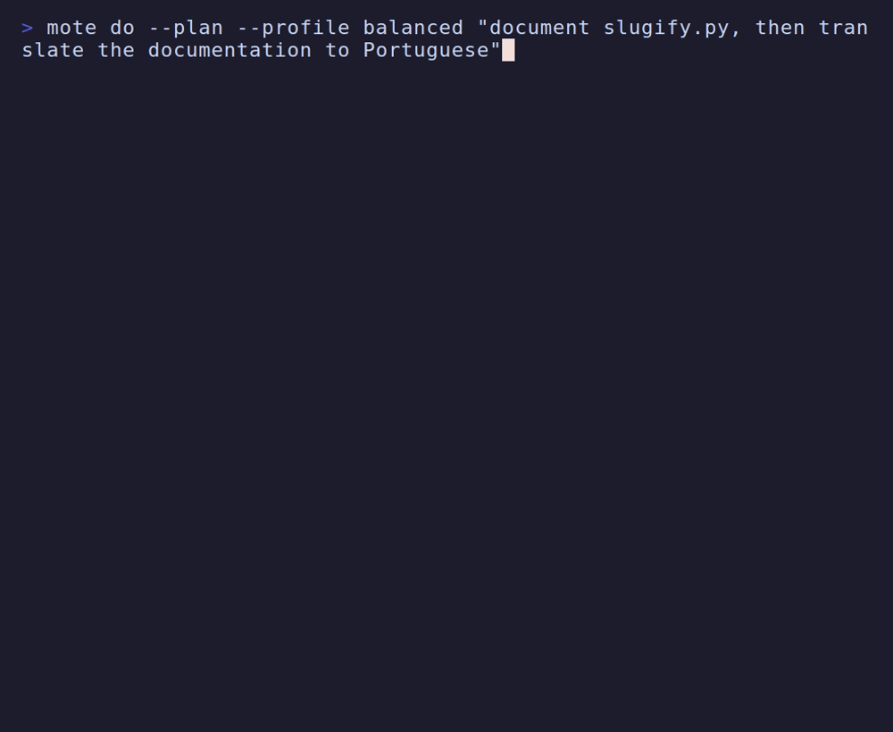
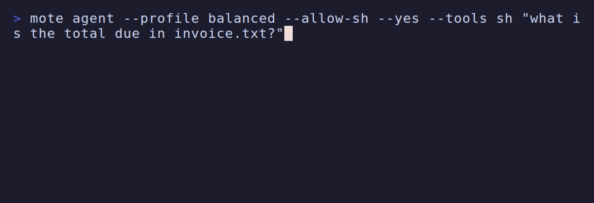
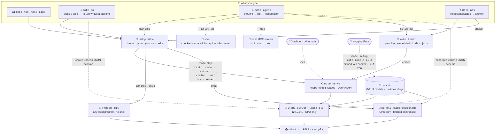

<p align="center">
  <picture>
    <source media="(prefers-color-scheme: dark)" srcset="docs/logo/mote-dark.svg">
    
  </picture>
</p>

<p align="center">Small models, local machines, useful work.</p>

<p align="center">
  <a href="https://github.com/JGalego/Mote/actions/workflows/ci.yml"></a>
  <a href="https://codecov.io/gh/JGalego/Mote"></a>
  <a href="https://github.com/JGalego/Mote/releases/latest"></a>
  <a href="LICENSE"></a>
  
</p>

mote runs X-to-Y AI tasks (text, code, images, audio, video, files) on your CPU with small quantized models. It is a single static binary that drives [llama.cpp](https://github.com/ggml-org/llama.cpp) and the tools you already have (`ffmpeg`, `git`, your editor). No accounts, no cloud inference, no telemetry.

## Contents

- [Getting started](#getting-started)
- [Commands](#commands)
- [Tasks](#tasks)
  - [chat](#chat---)
  - [code](#code---)
  - [refactor](#refactor---)
  - [doc](#doc---)
  - [extract](#extract---)
  - [summarize](#summarize---)
  - [translate](#translate---)
  - [commit](#commit---)
  - [review](#review---)
  - [explain](#explain---)
  - [ocr](#ocr---)
  - [describe](#describe-----)
  - [transcribe](#transcribe---)
  - [speak](#speak---)
  - [draw](#draw---)
  - [frames](#frames---)
  - [video](#video---)
  - [convert](#convert---)
  - [patch](#patch---)
  - [chained](#chained-)
  - [motebooks](#motebooks-)
  - [metamote](#metamote-)
  - [chosen](#chosen-)
  - [agent](#agent-)
  - [spoken](#spoken-)
  - [files](#files-)
  - [your own](#your-own-)
- [Memory](#memory)
- [Serving](#serving)
- [How it works](#how-it-works)
- [Models](#models)
- [License](#license)

## Getting started

### Linux 🐧 / macOS 🍎

```sh
curl -fsSL https://raw.githubusercontent.com/JGalego/Mote/main/install/install.sh | sh
```

### Windows 🪟

```powershell
irm https://raw.githubusercontent.com/JGalego/Mote/main/install/install.ps1 | iex
```

### Development 🧪

Install the current source instead of a release. Both commands replace whatever `mote` is installed, so run them as often as you like to move to the tip of `main`; set `MOTE_VERSION` to build a branch, tag or commit instead.

Building needs [Go 🦫](https://go.dev/dl/).

```sh
curl -fsSL https://raw.githubusercontent.com/JGalego/Mote/main/install/install.sh | MOTE_SOURCE=1 sh
```

```powershell
$env:MOTE_SOURCE=1; irm https://raw.githubusercontent.com/JGalego/Mote/main/install/install.ps1 | iex
```

In a clone, `go install ./cmd/mote` does the same into `$(go env GOPATH)/bin`. `mote version` reports the commit it was built from.

<!--img src="docs/demo/install.gif" width=70%/-->

## Commands

| Command | What it does |
| --- | --- |
| `mote help [COMMAND]` | Print general usage, or a command's flags, subcommands and examples; `mote COMMAND --help`/`-h` shows the same thing |
| `mote setup [--profile P] [--yes] [--gpu\|--no-gpu]` | Install the runtime and the models for a profile (`small`, `balanced`, `quality`); asks about GPU offload when one is detected |
| `mote run TASK [ARGS...]` | Run a task, e.g. `mote run chat "Explain what a mutex is"`; `-o FILE` writes the output, `--model ID` overrides the model, `--apply` writes `patch` changes |
| `mote chat [--system "..."]` | Talk with the text model; it sees the earlier turns. `/new` starts over, `/exit` or Ctrl-D ends, a line ending in `\` continues, Tab completes a `/command`. `--tools a,b\|all` lets it run mote tasks to answer, on the same think/act/observe loop as `mote agent`; off by default, and a task marked `"asks"` is confirmed before each call unless `--yes` |
| `mote guide` | Ask the text model about mote itself: which command or task fits a goal, or whether one task's output can feed another's input |
| `mote nb run FILE [-o FILE\|-] [--force] [--dry-run] [--yes]` | Run a motebook: a Markdown file whose `mote` cells are tasks or pipelines, with each output written into the file under its cell |
| `mote nb exec [--state FILE]` | Run the one cell on stdin and print its output; what the Jupyter kernel calls |
| `mote nb console [FILE \| -o FILE] [--yes]` | An interactive session, like `jupyter console`: each line is a cell that runs as you enter it, its output printed below; kept in FILE, or offered to be saved when you leave if there is none |
| `mote nb export FILE` / `mote nb import FILE.ipynb` | Convert a motebook to a Jupyter notebook for the mote kernel and back |
| `mote kernel install [--python PATH]` | Register mote as a Jupyter kernel, so a notebook cell can be a mote task and its output shows below it |
| `mote meta "GOAL" [-o FILE] [--chat] [--run] [--force]` | Write a motebook for a complex goal in one shot; `--chat` lets you change the plan first, `--run` runs it |
| `mote pipe "A \| B \| sh: cmd"` | Chain tasks in one process, each stage receiving the last one's value: `{}` or `-` places it, `sh:` runs a shell command, `--trace` shows each step |
| `mote do "REQUEST"` | Pick the task that fits a request written in plain words and run it; `--router embed` chooses with the encoder, `--plan` writes a pipeline of several tasks, `--dry-run` shows the choice |
| `mote agent "GOAL"` | Work towards a goal in steps, calling tasks and local tools and reading what they return; `--tools` picks them, `--allow-sh` offers the shell |
| `mote mcp [tools [NAME]]` | List the MCP servers in `mcp.json`, or start them and show which tools the agent can use |
| `mote remember "FACT"` | Keep a fact in front of every model step; `mote memory` lists them, `mote forget N\|--all` removes them |
| `mote memory [search "Q"]` | Show what mote remembers, or find a past exchange by meaning |
| `mote index DIR... [status\|rm]` | Index files under a folder for `mote ask`; re-run to refresh, `status` shows what's indexed, `rm DIR\|--all` forgets it |
| `mote ask "QUESTION" [--in DIR]` | Answer from the indexed files closest to the question, with the sources it used; `--sources` shows only the passages |
| `mote listen [TASK]` | Wait for a wake word on the microphone, then run what you say next (never listens unless you start it) |
| `mote serve [status\|stop]` | Keep models loaded and serve them to editors through an OpenAI-compatible API on `127.0.0.1:11435` |
| `mote tasks` | List the tasks, their arguments and what each one needs |
| `mote models [pull\|rm\|why\|verify]` | Show models, sizes and which are in use; fetch, remove, explain or re-verify them. `pull --missing` fetches the ones your profile uses, `pull --all` every one |
| `mote models upgrade [--check] [--prune]` | Fetch the newest registry and the best models it picks for your profile and RAM; `--prune` removes the ones no longer used |
| `mote bench [--full] [--strict]` | Measure installed models locally: startup, tokens/s, peak RSS, small pass/fail checks; `--strict` exits non-zero if any check failed |
| `mote tune [--apply]` | Propose config changes from those measurements, and record them with `--apply` |
| `mote doctor` | Check the installation: runtime, models, tools, data directory |
| `mote config [show\|set\|history\|rollback\|edit]` | Show or change the configuration; every version is kept |
| `mote completion bash\|zsh\|fish` | Print a shell completion script; `source <(mote completion bash)` in `.bashrc` completes commands, subcommands, models, tasks and flags |
| `mote update [--check]` | Update mote, or only report whether an update exists |
| `mote version` | Print the version |

## Tasks

### chat 📝 → 📝

`mote run chat PROMPT` — Answer a prompt.


### code 📝 → 💻

`mote run code PROMPT` — Write code from a description.


### refactor 💻 → 💻

`mote run refactor FILE INSTRUCTION` — Rewrite a source file following an instruction.


### doc 💻 → 📖

`mote run doc FILE` — Write Markdown documentation for a source file.


### extract 📄 → 📊

`mote run extract FILE [SCHEMA]` — Extract structured JSON from a document (text, PDF, Word, OpenDocument, PowerPoint or HTML).


### summarize 📄 → 📝

`mote run summarize INPUT [FOCUS]` — Summarize a document, web page or text of any length.

```sh
mote run summarize report.pdf
mote run summarize minutes.docx "the decisions and who owns them"
curl -s https://example.com | mote run summarize -
mote pipe "transcribe meeting.m4a | summarize"
```

`INPUT` is a file or the text itself (`-` reads stdin). PDFs need `pdftotext` from poppler; a scanned PDF with no text layer is read page by page by the vision model, which also needs `pdftoppm` and takes a minute or more per page on a CPU. Word, OpenDocument and PowerPoint files and HTML need nothing else. Text too long for the model's context is summarised in parts, and the parts are then combined.

### translate 📝 → 📝

`mote run translate LANGUAGE INPUT` — Translate text or a document into another language.

```sh
mote run translate French "Where is the train station?"
mote run translate English contrato.pdf -o contract.txt
mote pipe "transcribe entrevista.mp3 | translate English"
```

Long documents are translated in parts that each fit one reply, then joined in order.

### commit 🗂️ → 📝

`mote run commit [DIR]` — Write a commit message for the staged changes, in the style of the repository's recent commits.

```sh
git add -p && git commit -e -m "$(mote run commit)"
mote pipe "commit | sh: git commit -F -"
```

### review 🗂️ → 📝

`mote run review [DIR] [AGAINST]` — Review uncommitted changes, or the diff against a branch, for bugs.

```sh
mote run review                 # everything changed since HEAD
mote run review . main          # this branch against main
```

### explain 📝 → 📝

`mote run explain INPUT` — Explain an error message, a command, a log or a piece of code.

```sh
mote run explain "error[E0382]: borrow of moved value: \`v\`"
cargo build 2>&1 | mote run explain -
mote run explain deploy.sh
```

### ocr 📷 → 📝

`mote run ocr IMAGE` — Read the text in an image, such as a photo of a page or a screenshot, word for word.

### describe 📷 + 📝 → 📝

`mote run describe IMAGE [QUESTION]` — Describe an image or answer a question about it.


### transcribe 🔊 → 📝

`mote run transcribe AUDIO` — Transcribe speech from an audio or video file (ffmpeg converts non-WAV input).


### speak 📝 → 🔊

`mote run speak TEXT` — Synthesize speech to a WAV file.


### draw 📝 → 🎨

`mote run draw PROMPT [SIZE] [SEED]` — Generate an image from a description (`-o` names the PNG).

```sh
mote run draw "a lighthouse on a rocky coast at dusk, oil painting" -o lighthouse.png
mote run draw "a fox in the snow" 768x512 1234   # size and seed; the same seed redraws the same picture
```

Opt-in and slow: the first run needs `mote models pull flux2-klein-4b` (FLUX.2 klein 4B with its text encoder and stable-diffusion.cpp, 4.8 GB, Apache-2.0 and MIT), a machine with about 9 GB of RAM, and minutes per picture on a CPU: about 2.5 at 256×256 and 6 at 512×512 on a 6-core laptop. Prebuilt for Linux x86-64, macOS on Apple silicon and Windows x64.

### frames 🎬 → 📷

`mote run frames VIDEO [COUNT]` — Extract evenly spaced frames from a video.


### video 🎬 → 📝

`mote run video VIDEO` — Summarize a video from sampled frames and its speech.


### convert 📷 → 📷

`mote run convert FILE [WIDTH]` — Convert or resize an image, audio or video file with ffmpeg.


### patch 📁 → 🩹

`mote run patch DIR INSTRUCTION` — Propose changes to a directory as a diff; `--apply` writes them to disk.


### chained 🔗

`mote pipe "A | B | sh: cmd"` — Chain tasks in one process, so models stay loaded between stages.



```sh
mote pipe "transcribe meeting.m4a | chat 'Summarise in 3 bullets: {}'"
mote pipe "code 'Python script that prints the squares of 1 to 5' | sh: python3 -"
mote pipe --trace "frames clip.mp4 3 | describe | sh: tee notes.txt"
```

Each stage gets the previous value as `{}`, `-` or its first missing argument; several files run the stage once per file. `sh:` pipes the value into a shell command. `!` also works, but bash and zsh expand it inside double quotes. Only the last stage prints; `--trace` shows the others.

### motebooks 📓

`mote nb run FILE` — Run a Markdown file whose cells are tasks, and keep each output right under its cell. `mote nb console` — Type cells and see each output as you go.

````markdown
# Meeting

```mote as=transcript
transcribe meeting.m4a
```

```mote
chat "Summarise in 3 bullets: {{transcript}}"
```
````

A cell is a `mote` fence holding a task or a pipeline, written the way `mote pipe` takes it, so there is no `mote run` in front and `chat "what's the capital of France"` is a whole cell. Prose around the cells is left alone. `as=NAME` keeps a cell's output for the cells after it as `{{NAME}}`.

```sh
mote nb run meeting.mote.md            # runs the cells in order, saving after each one
mote nb run meeting.mote.md --dry-run  # which cells would run
mote nb run meeting.mote.md -o -       # print the result instead of rewriting the file
```

Each output goes into an `output` fence below its cell, the way Jupyter shows it. The fence's `key` fingerprints the cell and the values it read, so running the notebook again computes only the cells that changed or read something that did; `--force` computes them all. A cell that fails leaves the outputs before it in the file.

`mote nb console` is the same thing typed live, one cell at a time, like `jupyter console` (the replies here only illustrate the shape):

```console
$ mote nb console
In [1]: chat "what's the capital of France"
Paris.
In [2]: city = chat "name a famous landmark in the capital of France"
The Eiffel Tower.
In [3]: chat "how tall is it? {{city}}"
About 330 metres.
In [4]: /exit
save the 3 cells you ran to a file? [y/N] y
file name [session.mote.md], or n to discard: capital.mote.md
✓ saved 3 cells in capital.mote.md
```

At a terminal the line is yours to edit: the arrow keys, Home, End and Delete move and change it, Up and Down recall earlier cells, and **Tab** completes what the cursor is on: a `/command`, a task at the start of a cell or after a `|`, the name of a value inside `{{ }}`, or a file name. A notebook is not only cells. `/note TEXT` adds a paragraph of Markdown between them, and `/embed FILE` adds an image, or audio or video with a player's controls, written relative to the notebook so the two can move together; both are undone by `/undo` and kept like a cell. A Markdown viewer such as VS Code's preview shows them.

A `/command` is coloured as you type it, cyan while it can still be one and red once it cannot, so a slip shows before you press Enter. Type `/tasks` to see what a cell can run, `/examples` for cells to try, and `/vars` for what you have bound. If you type a sentence as if to a person, the console says so and shows the cell it would take, `chat "..."`.

Each line runs as you enter it and its output is printed below. With no file, as above, the session lives in memory and, when you leave, mote asks whether to save the cells you ran and where; `/save FILE` does it at any point, and `-o FILE` saves on exit without asking, which is how to keep a session that has no terminal. With `mote nb console FILE` the cell and its output are added to that file as you go. Either way the file is a notebook that `mote nb run` can run again later. `NAME = pipeline` binds an output for later cells, a line ending in `\` continues onto the next, `/cells` lists what you have, and `/undo` drops the last cell added. A cell that fails is not kept. Models stay loaded from one cell to the next, and opening an existing notebook picks up the values it has already computed.

#### In Jupyter

To have the same thing in a Jupyter or VS Code notebook, where you type a cell and its output appears below it, install mote as a kernel:

```sh
python3 -m pip install ipykernel   # if the Python you will use lacks it
mote kernel install                # or: --python ~/venvs/notebooks/bin/python
```

then choose the **mote** kernel for a notebook. A cell is one task or pipeline, or `name = pipeline` to keep its output for later cells:

```
chat "what's the capital of France"
```

```
city = chat "name a landmark in the capital of France"
```

```
chat "how tall is it? {{city}}"
```

An image a task writes, such as `draw`'s, is shown as an image. Cells run without asking first, being the ones you type, and restarting the kernel starts the session over. Each cell is a call to `mote nb exec`, and models stay loaded between cells in the [resident server](#serving). `mote kernel uninstall` removes it.

#### Moving between the two

A motebook is Markdown you can read and diff; a Jupyter notebook is what Jupyter and VS Code open. `mote nb export` and `mote nb import` convert one to the other:

```sh
mote nb export notes.mote.md          # notes.ipynb, for the mote kernel
mote nb import analysis.ipynb         # analysis.mote.md
```

Prose becomes markdown cells, a cell becomes a code cell written the way the kernel takes it (`name = pipeline` where the motebook has `as=name`), and what a cell printed goes with it. Going the other way, an imported output has no fingerprint, so `mote nb run` runs that cell again rather than trust what it cannot check. A notebook for another kernel is refused unless you pass `--any-kernel`, and nothing is replaced without `--force`.

A value is filled into a cell's arguments, so one that contains a `|`, a quote or a `{}` stays text. It cannot be filled into an `sh:` stage: pipe it in and use `{}`. Cells with an `sh:` stage, or a task that asks, run every time, and mote asks once before starting unless you pass `--yes`.

### metamote 🪞

`mote meta GOAL` — Have mote write the motebook for a complex goal.

```sh
mote meta "summarise talk.mp3, then translate the summary to French" -o talk.mote.md
mote nb run talk.mote.md
mote meta "explain what a mutex is, then write a Go example" -o mutex.mote.md --run
```

The text model writes the whole plan in one constrained generation, at most six cells, each with a sentence saying what it does. Later cells read earlier ones as `{{step1}}`, `{{step2}}`. mote checks the plan before writing anything: the tasks exist, their arguments fit, the files exist, and no cell reads one that comes after it. It then reads the notebook back and insists on the cells it started with. The model writes tasks, never shell commands, so a generated notebook does only what its tasks do. Without `-o` the notebook is printed; an existing file is only replaced with `--force`.

Read it, edit it, and run it with `mote nb run`; `--run` does both at once.

To shape the plan before it is written, add `--chat`: mote shows the notebook and asks what to change, and each change goes to the model with the current plan and comes back checked the same way. Enter keeps the plan, `q` gives it up. A change that produces a plan that cannot run is reported and the last good plan stays, so asking costs nothing.

```sh
mote meta "summarise talk.mp3, then translate the summary to French" --chat -o talk.mote.md
```

### chosen 🎯

`mote do REQUEST` — Pick the task that fits a request in plain words and run it.



```sh
mote do "summarise meeting.m4a in three bullets"
mote do "what is on the sign in photo.jpg" --dry-run
mote do --plan "document calc.py then translate it to French"
```

Existing paths in the request become file arguments and the rest becomes the text argument. The text model chooses by default; `--router embed` uses a 36 MB encoder instead, with no generation. Both match against the `examples` in [`tasks.json`](internal/task/tasks.json). `--plan` writes a `mote pipe` pipeline for requests that take several steps and checks it before running. `--dry-run` prints the command without running it.

### agent 🤖

`mote agent GOAL` — Work toward a goal by calling tasks one step at a time until it has an answer.



```sh
mote agent "what is the total due in invoice.txt?"
mote agent "how many Go files are in this repository?" --allow-sh
mote agent "find where retries are configured" --tools search,chat
```

Each step is a JSON-constrained tool call, and errors come back to the model as observations. Steps go to stderr and the answer to stdout. `--tools` limits the tools and `--steps` caps the run (default 8). The shell is off unless you pass `--allow-sh`. Commands are then checked before they run: a few catastrophic ones (`rm -rf ~`, `mkfs`, `curl … | sh`) are never run, `--yes` approves only read-only ones (`ls`, `cat`, `grep`, `git log`…), and anything else is asked about. Where the system allows, commands also run in a sandbox (bubblewrap on Linux, `sandbox-exec` on macOS) that can write only in the working directory, cannot see your home directory and has no network; there `--yes` approves the rest too. `--sandbox on|off` requires or skips it, `--sandbox-net` restores the network, and `mote doctor` shows whether one is available. Windows has none. The model is also told that tool output is data, not instructions. Use the `balanced` profile; the 0.8B model is too small to act reliably.

`--mcp NAME` adds the tools of a local [MCP](https://modelcontextprotocol.io) server listed in `mcp.json` in the config directory, in the `mcpServers` shape other clients use. Only servers started as a command are supported, not remote ones. Tools with arguments too complex for a grammar are skipped, and tools not marked read-only ask before each call. `mote mcp tools NAME` shows what a server offers; pick a few with `--tools server.tool`.

```json
{"mcpServers": {"files": {"command": "npx", "args": ["-y", "@modelcontextprotocol/server-filesystem", "."]}}}
```

### spoken 🎤

`mote listen [TASK]` — Transcribe the microphone in chunks and run what follows the wake word.

```sh
mote listen                       # "hey mote, explain what a mutex is"
mote listen code --wake "ok mote"
```

The wake word defaults to `hey mote` (`--wake` or `mote config set wake_word`). `--chunk` sets the seconds per recording, `--device` the input (required on Windows) and `--once` stops after one request.

### files 🔍

`mote index DIR...` then `mote ask "QUESTION"` — Answer questions from your own files instead of the model's memory.

```sh
mote index ~/notes ~/projects/mote/docs   # embeds every file under both folders
mote ask "what did we decide about retries"
mote ask "how does the logo get generated" --in ~/projects/mote/docs --sources
mote index                                # re-run with no folders to refresh what's indexed
```

Each file is split into passages, embedded, and kept in `index.json` in the data directory; `mote index` again only re-embeds files that changed. `mote ask` embeds the question, finds the closest passages (`--top`, default 6) and answers from them alone, citing each one like `[2]`; `--sources` prints the passages instead of asking a model to answer. A passage too dense for the embedding model's batch size is skipped, not the whole file or run; `mote index status` lists anything unreadable. `mote index rm DIR` forgets one folder, `--all` clears the index. When something is indexed, `mote agent` also gets a `files` tool to search it mid-task.

### your own 🧩

Tasks are data: drop a file shaped like [`tasks.json`](internal/task/tasks.json) into `tasks/` under the config directory (`mote tasks` prints the path). A matching id replaces a built-in. An `exec` step wraps a local program without a shell, and `"asks": true` makes `mote agent` and `mote do` confirm before running a task a model chose:

```json
{"op": "exec", "cmd": ["rg", "--line-number", "--", "{{pattern}}", "{{dir}}"], "as": "out"}
```

[`examples/tools.json`](examples/tools.json) wraps `rg`, `jq` and `git log`. See [extending mote](docs/extending.md).

## Memory

Mote forgets everything between runs unless you ask it not to, and what it
keeps are plain files you can read, edit and delete.

```sh
mote remember "I write Go, and prefer short answers"   # a fact, kept in front of every model step
mote config set memory true                            # start keeping a history of exchanges
mote run chat "and in Python?" --continue              # carry on from the last exchanges
mote run chat "remind me about locks" --recall         # bring back the closest past exchanges
mote memory search "mutex"                             # find one yourself
mote forget 2 | mote forget --all | mote forget --history
```

Facts live in `facts.txt` in the config directory; the history is
`history.jsonl` in the data directory, written only while `memory` is true,
and never sent anywhere. `--recall` and `mote memory search` compare meaning
with the same encoder the router uses, so they find an exchange that used
different words.

## Serving

Loading a model takes a few seconds, so mote keeps the ones a command used loaded for five minutes, in a small background server that the next command reuses. A second `mote run chat` answers in a fraction of a second instead of reloading. The server stops itself once nothing has been used for that long, unloads the least recently used model when another would not fit in memory, and is replaced if you change how models load (`threads`, `repack`, `gpu`, the runtime, or mote itself).

```sh
mote serve status                  # what is loaded, and for how long
mote serve stop                    # unload everything now
mote config set keep_alive 30m     # keep models longer
mote config set keep_alive 0       # never start it: each command loads its own models
```

Run `mote serve` yourself to keep it in the foreground and give other programs the same models. It speaks the OpenAI API on `http://127.0.0.1:11435/v1` (`--port` or `serve_port` to change it), with `/v1/chat/completions`, `/v1/completions`, `/v1/embeddings` and `/v1/models`. Name a model by its id, or by a capability (`text`, `code`, `vision`, `embed`; `mote` means `text`) to get the one mote picked for your machine. Any API key works.

```sh
mote serve &
curl -s http://127.0.0.1:11435/v1/chat/completions -H 'Content-Type: application/json' \
  -d '{"model": "mote", "messages": [{"role": "user", "content": "Say hello in French"}]}'
aider --openai-api-base http://127.0.0.1:11435/v1 --openai-api-key local --model openai/code
```

It answers only on the loopback interface, and refuses requests whose `Host` or `Origin` is not local, so a web page cannot reach it. Speech and image generation still run in the command that asks for them.

## How it works



Inference runs in llama.cpp servers bound to `127.0.0.1`, held by `mote serve` between commands, on the CPU alone (`--device none`) unless you turn GPU offload on. GGUF weights come from Hugging Face only when you allow it, pinned to a commit and verified by SHA-256.

Models, logs, benchmark results and the file index (`index.json`) live in the data directory (`~/.local/share/mote`, `~/Library/Application Support/mote`, `%LOCALAPPDATA%\mote`), configuration in the OS config directory. After setup, mote itself touches the network only for `mote update` and explicit pulls; MCP servers you add are programs of their own and may do more.

Tasks are short pipelines in [`internal/task/tasks.json`](internal/task/tasks.json): each step calls a model capability (`text`, `code`, `extract`, `vision`, `asr`, `tts`, `embed`, and the opt-in `image`, which runs on stable-diffusion.cpp) or a local program (`ffmpeg`, `git`, or any other through `exec`), and every capability has its own specialized model.

`mote do` and `mote agent` never let a model call anything directly. Every choice the model makes is generated under a JSON schema listing only the real tasks and tools, so it cannot name one that does not exist or give it malformed arguments. mote then runs the call and feeds the result back. The agent's shell commands are checked, confirmed and, where possible, sandboxed. MCP servers are only ever local processes.

## Models


[`registry/models.json`](registry/models.json) is generated from [`candidates.json`](registry/candidates.json) (the models and quantizations we consider) and [`policy.json`](registry/policy.json) (per-capability thresholds for the `small`, `balanced` and `quality` profiles): mote picks the smallest model that fits your RAM and meets the threshold, and `mote models why text` prints the reasoning and sources.

Scores come from Hugging Face `evalResults`, stored with source, date and verification flag; RAM figures are labelled estimates. A [daily workflow](.github/workflows/refresh.yml) re-reads them and commits only what changed; `mote models upgrade --check` shows whether that changed your picks, and `mote models upgrade` downloads the new ones. A [nightly workflow](.github/workflows/quality.yml) then runs mote's own task checks (`mote bench --full --strict`) against whatever the registry now picks for the default profile, on real CPU inference, so a bad swap is caught the morning after it lands. Locally, `mote bench` measures installed models, `mote tune --apply` turns the results into config, and `mote config rollback` undoes it.

Loading skips work mote does not need: llama.cpp's memory fitting (`--fit off`, since mote sets the device and context itself) and, for a server that answers a single command, repacking the weights for faster CPU kernels (`--no-repack`), which roughly halves load time and costs some prompt speed. `mote bench --full` times loading both ways on your machine, and `mote tune` sets `repack` to `on` when repacking pays for itself within a typical prompt.

mote stays CPU-only by default; `mote config set gpu on` (or `mote setup --gpu`, which asks when it finds one) offloads inference to a GPU instead. On Linux and Windows this downloads a second, separate llama.cpp build (Vulkan, one that works across NVIDIA, AMD and Intel GPUs alike, since a CUDA build would need matching driver and toolkit versions mote cannot pin reliably); on macOS nothing more downloads, since the default build already includes Metal. `mote doctor` reports what was detected and which build is in use; `mote config set gpu off` goes back to the CPU.

## License

[MIT 🏛️](LICENSE.md)

Models are downloaded under their own licenses, which are shown before download.
